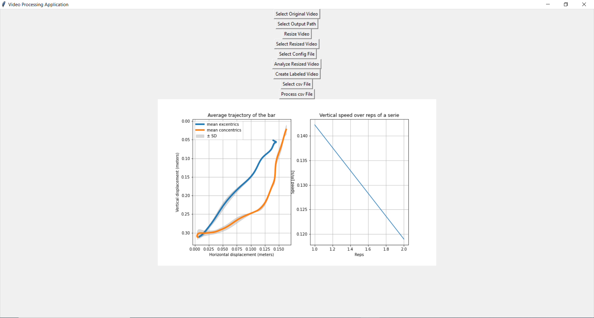

# Velocity Based Training App
A tkinter app on pc to track barbell speed and trajectory in powerlifting.

## Showcase
*The returned video*
 

 
*The application and returned barbell trajectory plot and velocity plot over the reps of a serie*
 

## How it works 
Using DeepLabCut, I've created my own light model to track the center of a barbell as well as the top and the bottom of a plate. Knowing that a calibrated plate of 20kg + is 45cm, it is then possible to convert pixels in cm and to measure speed.

## How to use it
First get a portrait side view video of any powerlifting lift with calibrated plates. Download [DeepLabCut](https://github.com/DeepLabCut/DeepLabCut) and create an python env with it. Then lauch the app, every paths should be ok but you might have to change the project path one in the yaml.
Then follow each button one by one. We are compressing the quality of the original video to analyse faster (my pc is kinda slow). Dont forget to name the compressed video with a **.mp4** at the end. The config file to select is this one *force_vitesse_power-LeFailler-2024-02-18/config.yaml* . 
Videos and csv files will be created in the folder wich contains your original video. Select the filtered csv file preferentially to plot the paths. 

## Limitations
Only works with calibrated plates of at least 20kg (45cm diameter). (Actually kinda work with 15kg or 10kg plates, but will not give accurate values of speed). Also, perfectly sideview is necessary for accurate bar path, otherwise only bar speed will be usable. 
Be carefull using it to not have other plates in the camera range, could cause tracking issues. 
For anonymisation issues I cannot provide the used training and test sets. 

### In coming soon
a requirements.txt, a force velocity profiling if multiple files and weight provided and more.
