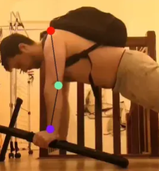

# 🏋️‍♂️ Barbell Tracker & Performance Profiler

A Desktop application built with **Python**, **Tkinter**, and **DeepLabCut** to track barbell and bodyweight kinematics. Designed for researchers, coaches, and athletes to monitor Speed, Range of Motion (ROM), and Force-Velocity Profiling.

## 🌟 Key Features

* **Multi-Modal Tracking:** Support for both Powerlifting (Barbell) and Calisthenics (Bodyweight) movements.
* **Video Analysis:** Automated trajectory and speed tracking with smart scaling.
* **Live Webcam Mode:** Real-time feedback using your PC's camera with on-screen smoothing (work in progress).
* **Force-Velocity Profiling (FVP):** Multi-load analysis to determine theoretical $F_0$, $V_0$, and profile slope.
* **Smart Repetition Detection:** Automatic detection of eccentric and concentric phases with a manual editor.
* **Data Export:** Save your results and figures in **JSON** or **CSV** format for external analysis.
* **Biomechanical Metrics:**
    * Mean & Peak Velocity ($m/s$).
    * Vertical Range of Motion ($cm$).
    * Real-time Trajectory Mapping.

---

## 📸 Showcase

### 🎥 Kinematic Output
The system generates a labeled video showing the bar path or joint trajectory.
<br>

<br>

### 📊 Advanced Analytics
| Main Menu | Biomechanical Metrics | Force-Velocity Profiling |
| :--- | :--- | :--- |
|  |  |  |

### 🔍 **NEW:** Calisthenics Preview (Alpha)


---

## 🧠 How it Works

The application utilizes custom-trained **DeepLabCut** models (MobileNetV2 architecture).

1. **Tracking:** * **Powerlifting:** Tracks the center of the barbell and the edges of the plate.
   * **Calisthenics (Alpha):** Tracks wrist, elbow, and shoulder.
2. **Calibration:** * For Barbell: Uses the standard **45cm** plate to calculate a `pixels-to-meters` scale.
   * For Calisthenics: Uses an anatomical scaling factor (forearm length estimated at 16% of user height).
3. **Physics Engine:** Data is filtered using a **Butterworth Lowpass Filter** (via `scipy`) to remove measurement noise before calculating velocity.

---

## 🛠️ Installation & Setup

To run this project, you need a Python environment (3.8 - 3.10 recommended).

### 1. Clone the repository
```bash
git clone [https://github.com/LeFaillerFrancois/app_vbt.git](https://github.com/LeFaillerFrancois/app_vbt.git)
cd app_vbt
```

### 2. Create a Virtual Environment
```bash
python -m venv venvname
```
```bash
# On Windows
venvname\Scripts\activate
```
```bash
# On Mac/Linux
source venvname/bin/activate
```
### 3. Install Dependencies
```bash
pip install -r requirements.txt
```
### 4. Run the Application
```bash
python main.py
```

---

## 📖 How to Use

#### **Video Analysis**
1. Go to **Video Processing**.
   
2. choose between the **Powerlifting** or **Calisthenics** model depending on your workout type (check).

3. Select a side-view video (mp4).

4. The software will resize the video and run the DeepLabCut inference (Progress Bar included).

5. View results and edit reps if needed via the integrated Rep Editor.

6. **NEW :** **Export:** Use the "Save" buttons to export data as CSV/JSON or save the generated figures.

*Even if Github isn't made for that you can find test videos with the excepted results of the analysis in the test_video file.* 
<br>

#### **Live Webcam**
1. Position your camera perpendicular to the barbell.

2. Click **Start Webcam**.

3. The real-time smoothing algorithm will track the bar even with minor camera shake.


#### **Force-Velocity Profile**

1. Collect CSV files from multiple trials with different weights.
   
2. In the **Multiple File Page**, add each CSV and enter the corresponding load (kg).
   
3. Click **Compute Profile** to generate your linear regression ($Load = Velocity \times Slope + F_0$) and displays the graph.

---

## ⚠️ Limitations & Requirements
- **NEW:** **Calisthenics Model:** Currently in Alpha. Trained on limited data (pull-ups/dips); accuracy may vary.
- **Camera Placement**: Camera must be strictly perpendicular (side-view) to the barbell. A tilted camera will distort the ROM measurements.
- **Environment**: Try to avoid having other plates in the background to prevent tracking interference.
- **Hardware**: Analysis is faster with an NVIDIA GPU, but compatible with CPU-only machines.

---

## 🗺️ Roadmap
- [ ] **Data Export**: Save analysis reports as PDF or Excel.
- [ ] **Power Output**: Calculate Watts based on athlete's body weight + bar load and other metrics.
- [ ] **Cloud Sync**: Store athlete profiles over time. ?
- [ ] **TFLite Integration**: Lightweight inference for faster CPU performance.

--- 

## 🤝 Contribution
Developed by **Le Failler François**. Feel free to reach out for suggestions or bugs!
