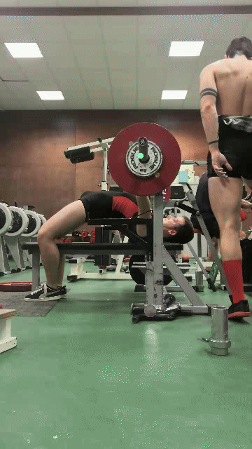
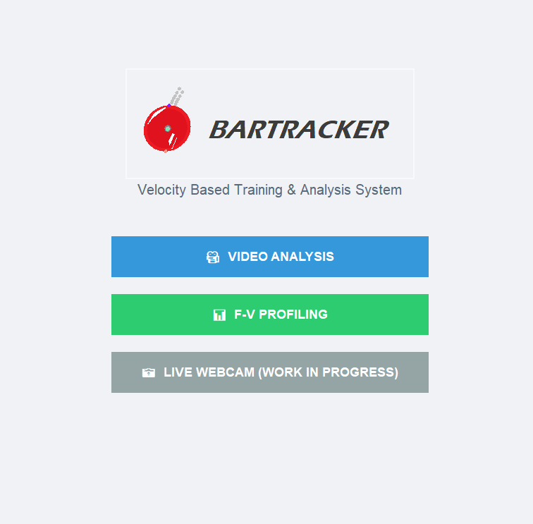
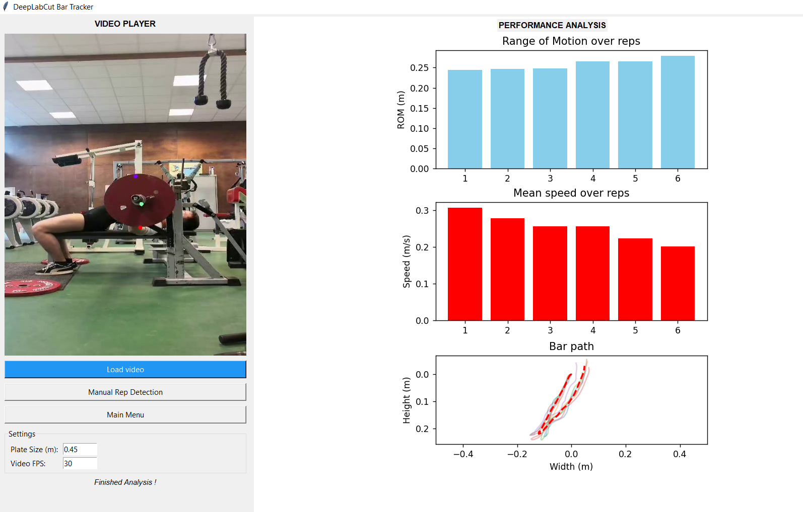
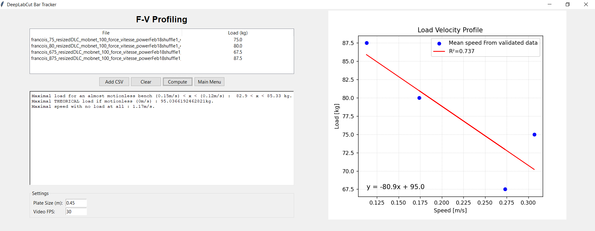
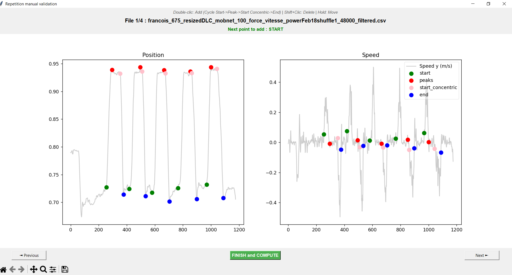

# 🏋️‍♂️ Barbell Tracker & Performance Profiler

A Desktop application built with **Python**, **Tkinter**, and **DeepLabCut** to track barbell kinematics in real-time or from recorded videos. Designed for researchers, Powerlifting coaches and athletes to monitor Bar Speed, Range of Motion (ROM), and Force-Velocity Profiling.

## 🌟 Key Features

* **Video Analysis:** Automated tracking of barbell trajectory and speed with smart scaling.
* **Live Webcam Mode:** Real-time feedback using your PC's camera with on-screen smoothing (work in progress).
* **Force-Velocity Profiling (FVP):** Multi-load analysis to determine theoretical $F_0$, $V_0$, and profile slope.
* **Smart Repetition Detection:** Automatic detection of eccentric and concentric phases with a manual editor for perfect accuracy.
* **Biomechanical Metrics:**
    * Mean & Peak Velocity ($m/s$).
    * Vertical Range of Motion ($cm$).
    * Real-time Trajectory Mapping.

---

## 📸 Showcase

### 🎥 Kinematic Output
The system generates a labeled video showing the bar path.
<br>

<br>

### 📊 Advanced Analytics
| Main Menu | Biomachnical Metrics |  Force-Velocity Profiling |
| :--- | :--- | :--- |
|  |  |  |

### 🔍 Automatic rep detection with manual validation


---

## 🧠 How it Works

The application utilizes a custom-trained **DeepLabCut** model (MobileNetV2 architecture).
1.  **Tracking:** The AI tracks the center of the barbell and the edges of the plate.
2.  **Calibration:** By knowing a standard competition plate is **45cm**, the software automatically calculates a `pixels-to-meters` scale factor. You're allowed to change the default value in plate size settings in case you're not using standard competition plate.
3.  **Physics Engine:** Data is filtered using a **Butterworth Lowpass Filter** (via `scipy`) to remove measurement noise before calculating velocity.

---

## 🛠️ Installation & Setup

To run this project, you need a Python environment (3.8 - 3.10 recommended).

### 1. Clone the repository
```bash
git clone [https://github.com/yourusername/barbell-tracker.git](https://github.com/yourusername/barbell-tracker.git)
cd barbell-tracker
```

### 2. Create a Virtual Environment
```bash
python -m venv venvname
# On Windows
venvname\Scripts\activate
```
```bash
# On Mac/Linux
source venvname/bin/activate
```
### 3. Install Dependencies
```bash
pip install -r requirements.txt
```
### 4. Run the Application
```bash
python main.py
```

---

## 📖 How to Use
#### **Video Analysis**
1. Go to **Video Processing**.

2. Select a side-view video (mp4).

3. The software will resize the video and run the DeepLabCut inference (Progress Bar included).

4. View results and edit reps if needed via the integrated Rep Editor.

*Even if Github isn't made for that you can find test videos with the excepted results of the analysis in the test_video file.* 
<br>

#### **Live Webcam**
1. Position your camera perpendicular to the barbell.

2. Click **Start Webcam**.

3. The real-time smoothing algorithm will track the bar even with minor camera shake.


#### **Force-Velocity Profile**

1. Collect CSV files from multiple trials with different weights.
   
2. In the **Multiple File Page**, add each CSV and enter the corresponding load (kg).
   
3. Click **Compute Profile** to generate your linear regression ($Load = Velocity \times Slope + F_0$) and displays the graph.

---

## ⚠️ Limitations & Requirements
- **Camera Placement**: Camera must be strictly perpendicular (side-view) to the barbell. A tilted camera will distort the ROM measurements.
- **Environment**: Try to avoid having other plates in the background to prevent tracking interference.
- **Hardware**: Analysis is faster with an NVIDIA GPU, but compatible with CPU-only machines.

---

## 🗺️ Roadmap
- [ ] **Data Export**: Save analysis reports as PDF or Excel.
- [ ] **Power Output**: Calculate Watts based on athlete's body weight + bar load and other metrics.
- [ ] **Cloud Sync**: Store athlete profiles over time. ?
- [ ] **TFLite Integration**: Lightweight inference for faster CPU performance.

--- 

## 🤝 Contribution
Developed by **Le Failler François**. Feel free to reach out for suggestions or bugs!
